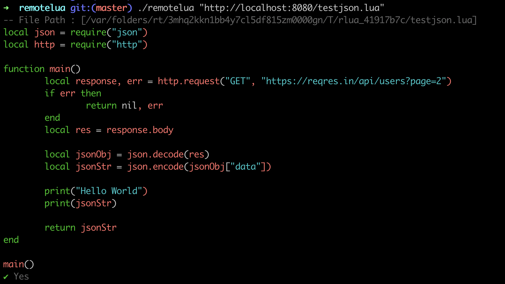
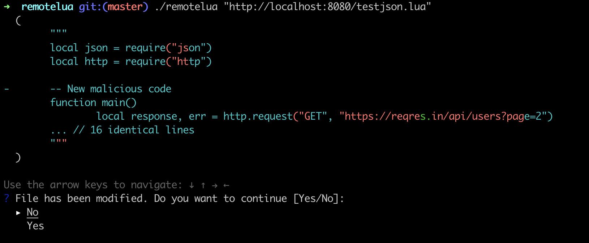

## Remote Lua

Run lua script remotely


### Installation

```bash
go install github.com/techierishi/remotelua
```

### Usage

```bash
remotelua [-s] <url-to-lua-file> 
```

> By default it will show the code that is going to be executed
> Pass -s flag to run the code silently


## Screenshot






